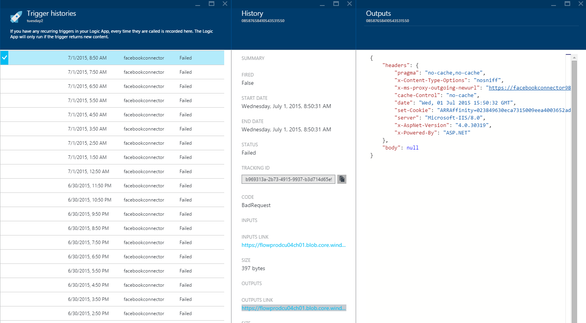

<properties 
	pageTitle="Monitor your Logic Apps" 
	description="How to see what your Logic Apps have done." 
	authors="stepsic-microsoft-com" 
	manager="dwrede" 
	editor="" 
	services="app-service\logic" 
	documentationCenter=""/>

<tags
	ms.service="app-service-logic"
	ms.workload="integration"
	ms.tgt_pltfrm="na"
	ms.devlang="na"
	ms.topic="article"
	ms.date="07/01/2015"
	ms.author="stepsic"/>

#Monitor your Logic Apps

After you created a Logic App by following the steps described in  [Created a Logic App](app-service-logic-create-a-logic-app.md), you can see the full history of its execution in the Azure portal. To view the history, click on **Browse** at the left side of the portal screen and select **Logic Apps**. A list of Logic Apps in your subscription will appear. A Logic App can be **Enabled** or **Disabled**. **Enabled** Logic Apps means that triggers will run your Logic App in response to trigger events, **Disabled** Logic App will not run in response to events.

When the blade for your Logic App appears, there are 2 sections that are useful:

- **Summary**, which tells you the latest status and is an entry point to editing your Logic App.
- **All runs**, which shows you a list of the runs this Logic App has had.

##Runs

This list of runs shows the **Start time**, the **Run identifier** (you can use this when calling the REST API), and the **Duration** of the particular runs. Click any row to see details on that run.

The details blade shows a graph with the execution time and sequence of all of the actions in the run. Below that, is the full list of all of the actions that were executed.

Finally, on a particular action, you can get all of the data that was passed to the action, and that was received from the action in the **Inputs** and **Outputs** sections. Click on the links to see the full content (you can also copy the links to download the content). 

Another important piece of information is the **Tracking ID**. This identifier is passed in the headers of all action calls. If you have logging inside of your own service, we recommend logging the Tracking ID, and then you can cross-reference your own logs with this identifier.

##Trigger history 

Polling triggers check an API on some interval but don't necessarily start a run, depending on the response (for example a `200` means to run and a `202` means to not run). The trigger history gives you a way to see all of the calls that happen but that don't run the Logic App (the `202` responses).

For each trigger you can see if it **Fired**, if it didn't fire, or, if it had some sort of error (it **Failed**). To inspect why your trigger failed you can click on the **Outputs** link. If it did fire, click the **Run** link to see what happened after it fired.

Note that for *Push* triggers, you will *not* see the times that the runs started here, instead you will see the *callback registration* calls - these are when the Logic app registers to get called back. If your push trigger is not working, it may be a problem with the registration (which you can see on the Outputs), but otherwise you many need to investigate that API specifically.

##Versioning

There is an additional capability that is not currently possible in the UI (coming soon) but is available via [the REST api](http://go.microsoft.com/fwlink/?LinkID=525617&clcid=0x409). When you update the definition of a Logic App, the previous version of the definition is stored. This is because if you already have a run in progress, that run will reference the version of the Logic App that existed when the run started. Definitions of runs cannot change while they are in progress. The Version history REST api gives you access to this information.
 