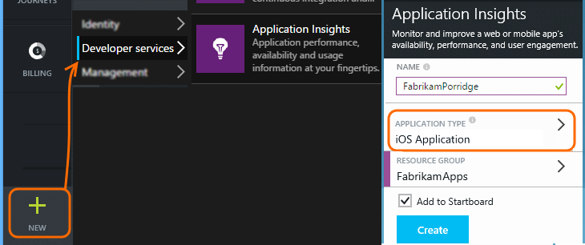
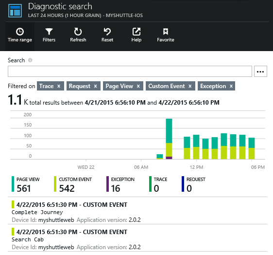
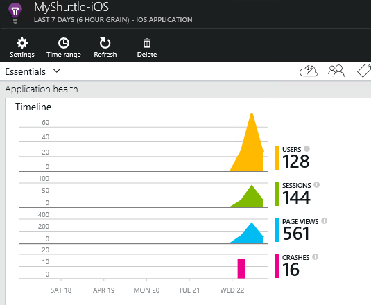
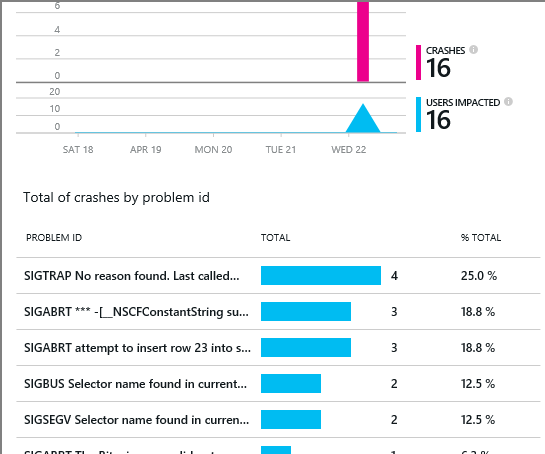

<properties 
    pageTitle="Application Insights for iOS apps" 
    description="Analyze usage and performance of your iOS app with Application Insights." 
    services="application-insights" 
    documentationCenter="ios"
    authors="alancameronwills" 
    manager="ronmart"/>

<tags 
    ms.service="application-insights" 
    ms.workload="tbd" 
    ms.tgt_pltfrm="ibiza" 
    ms.devlang="na" 
    ms.topic="article" 
    ms.date="04/27/2015" 
    ms.author="awills"/>

# Application Insights for iOS apps

Visual Studio Application Insights lets you monitor your mobile application for usage, events, and crashes.

## Requirements

You'll need:

* A subscription with [Microsoft Azure](http://azure.com). You sign in with a Microsoft account, which you might have for Windows, XBox Live, or other Microsoft cloud services.
* Xcode 6 or later.
* The SDK runs on devices with iOS 6.0 or later.

## Create an Application Insights resource

In the [Azure portal][portal], create a new Application Insights resource. Pick the iOS option.

The blade that opens is the place where you'll see performance and usage data about your app. To get back to it next time you login to Azure, you should find a tile for it on the start screen. Alternatively click Browse to find it.

## Download Application Insights for Mac

(If you didn't do this already.)

1. Download [Application Insights for Mac](http://go.microsoft.com/fwlink/?LinkID=533209)

2. Extract the zip file

3. Click the app icon to start Application Insights for Mac

## Sign in to Azure

1. Click on Sign In

2. Sign in with your Azure account

## Install the SDK in your application

1. Click on Integrate to start the SDK integration

2. Select your Xcode project from the list or click on Open Other to find your project, then click Integrate

3. Choose the folder for the Application Insights SDK, then click on Install

4. Add the shown run script to your build phases

    [Add Run Script Phase](http://hockeyapp.net/help/runscriptbuildphase/)

5. Add the missing frameworks to your Xcode project

6. Drag the Application Insights framework to your Xcode project, then click Next

7. Select Integrate SDK into Target for your target

8. Click on Create New Component to create your app in the Application Insights portal

9. Select your subscription, resource group, and enter a component name. In most cases, this should match your app's name. Confirm with the Create Resource button.

10. Make sure the right component is selected, then click Next

11. Modify your source code as shown in the wizard, then click Finish

12. Launch your app in the iOS simulator with Build & Run

## Insert telemetry calls

Once `[MSAIApplicationInsights start]` is called, the SDK will begin tracking sessions, page views, and any unhandled exceptions or crash. 

You can add additional events as follows:

    // Send an event with custom properties and measuremnts data
    [MSAITelemetryManager trackEventWithName:@"Hello World event!"
                                  properties:@{@"Test property 1":@"Some value",
                                             @"Test property 2":@"Some other value"}
                                 measurements:@{@"Test measurement 1":@(4.8),
                                             @"Test measurement 2":@(15.16),
                                             @"Test measurement 3":@(23.42)}];

    // Send a message
    [MSAITelemetryManager trackTraceWithMessage:@"Test message"];

    // Manually send pageviews (note: this will also be done automatically)
    [MSAITelemetryManager trackPageView:@"MyViewController"
                               duration:300
                             properties:@{@"Test measurement 1":@(4.8)}];

    // Send custom metrics
    [MSAITelemetryManager trackMetricWithName:@"Test metric" 
                                        value:42.2];

## View your data in Application Insights

Return to http://portal.azure.com and browse to your Application Insights resource.

Click Search to open [Diagnostic Search][diagnostic] - that's where the first events will appear. If you don't see anything, wait a minute or two and click Refresh.

As your app is used, data will appear in the overview blade.

Click on any chart to get more detail. For example, crashes:

## Next Steps

[Track usage of your app][track]

[Diagnostic search][diagnostic]

[Metric Explorer][metrics]

[Troubleshooting][qna]

<!--Link references-->

[diagnostic]: app-insights-diagnostic-search.md
[metrics]: app-insights-metrics-explorer.md
[portal]: http://portal.azure.com/
[qna]: app-insights-troubleshoot-faq.md
[track]: app-insights-custom-events-metrics-api.md

 