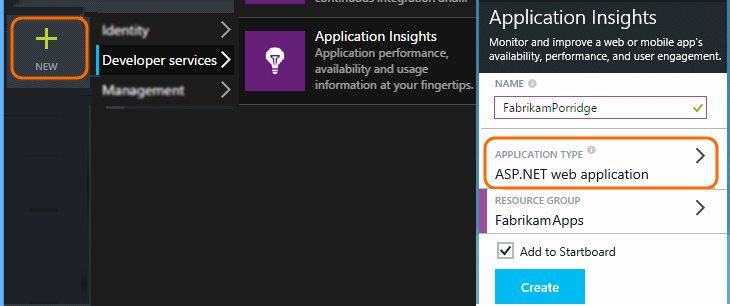
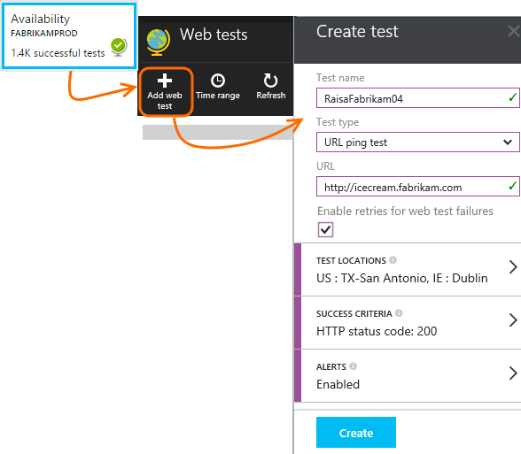
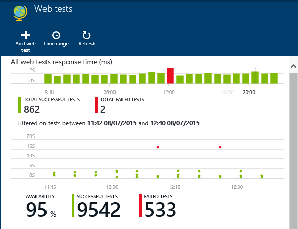
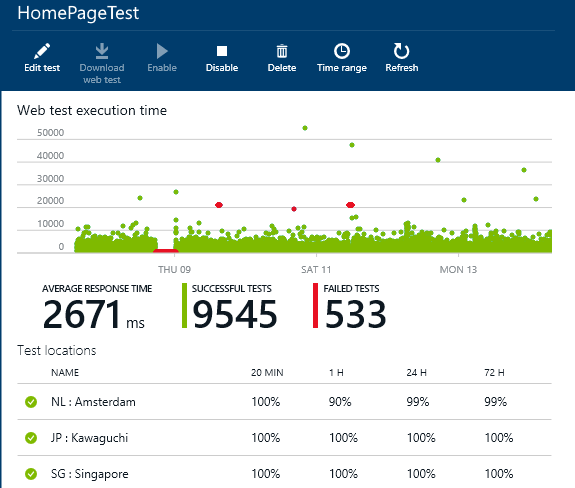
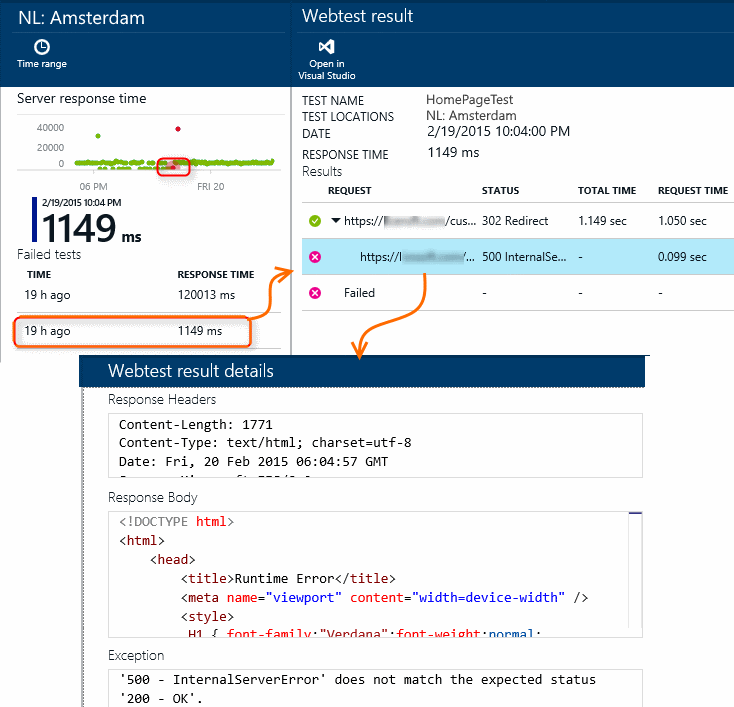

<properties 
	pageTitle="Monitor availability and responsiveness of any web site" 
	description="Set up web tests in Application Insights. Get alerts if a website becomes unavailable or responds slowly." 
	services="application-insights" 
    documentationCenter=""
	authors="alancameronwills" 
	manager="douge"/>

<tags 
	ms.service="application-insights" 
	ms.workload="tbd" 
	ms.tgt_pltfrm="ibiza" 
	ms.devlang="na" 
	ms.topic="article" 
	ms.date="07/08/2015" 
	ms.author="awills"/>
 
# Monitor availability and responsiveness of any web site

[AZURE.INCLUDE [app-insights-selector-get-started](../../includes/app-insights-selector-get-started.md)]

After you've deployed your web application, you can set up web tests to monitor its availability and responsiveness. Application Insights will send web requests at regular intervals from points around the world, and can alert you if your application responds slowly or not at all.

You can set up web tests for any HTTP endpoint that is accessible from the public internet.

There are two types of web test:

* [URL ping test](#set-up-a-url-ping-test): a simple test that you can create in the Azure portal.
* [Multi-step web test](#multi-step-web-tests): which you create in Visual Studio Ultimate or Visual Studio Enterprise and upload to the portal.

*Is it an Azure web app? Just [create the web test in the web app blade][azure-availability].*

## Set up a URL ping test

### 1. Create a new resource?

Skip this step if you've already [set up an Application Insights resource][start] for this application, and you want to see the availability data in the same place.

Sign up to [Microsoft Azure](http://azure.com), go to the [Azure portal](https://portal.azure.com), and create a new Application Insights resource. 

The Overview blade for the new resource will open. To find this at any time in the [Azure portal](https://portal.azure.com), click Browse.

### 2. Create a web test

In your Application Insights resource, look for the Availability tile. Click it to open the Web tests blade for your application, and add a web test. 

- **The URL** must be visible from the public internet. It can include a query string - so for example you could exercise your database a little. If the URL resolves to a redirect, we will follow it, up to 10 redirects.

- If **Enable retries** is selected, then when the test fails, it is retried after a short interval. A failure is reported only if three successive attempts fail. Subsequent tests are then performed at the usual interval. Retry is temporarily suspended until the next success. This rule is applied independently at each test location.

- **Test locations** are the places from where our servers send web requests to your URL. Choose more than one so that you can distinguish problems in your website from network issues. You can select up to 16 locations.

- **Success criteria**:

    **HTTP status code**: 200 is usual. 

    **Content match**: a string, like "Welcome!" We'll test that it occurs in every response. It must be a plain string, without wildcards. Don't forget that if your page content changes you might have to update it.

- **Alerts** are, by default, sent to you if there are repeated failures over 15 minutes. But you can change it to be more or less sensitive, and you can also change the notified email addresses.

#### Test more URLs

You can add tests for as many URLs as you like. For example, as well as testing your home page, you could make sure your database is running by testing the URL for a search.

### 3. View availability reports

After 1-2 minutes, click Refresh on the availability/web tests blade. (It doesn't refresh automatically.)

Click any bar on the summary chart at the top for a more detailed view of that time period.

These charts combine results for all the web tests of this application.

#### Components of your web page

Images, style sheets and scripts and other static components of the web page you're testing are requested as part of the test.  

The recorded response time is the time taken for all the components to complete loading.

If any component fails to load, the test is marked failed.

## If you see failures...

Click a red dot.

Or, scroll down and click a test where you see less than 100% success.

This shows you the results for that test.

The test is run from several locations - pick one where the results are less than 100%.

Scroll down to **Failed tests** and pick a result.

Click the result to evaluate it in the portal and see why it failed.

Alternatively, you can download the result file and inspect it in Visual Studio.

*Looks OK but reported as a failure?* Check all the images, scripts, style sheets and any other files loaded by the page. If any of them fails, the test will be reported as failed, even if the main html page loads OK.

## Multi-step web tests

You can monitor a scenario that involves a sequence of URLs. For example, if you are monitoring a sales website, you could test that adding items to the shopping cart works correctly. 

To create a multi-step test, you record the scenario by using Visual Studio, and then upload the recording to Application Insights. Application Insights will replay the scenario at intervals and verify the responses.

#### 1. Record a scenario

Use Visual Studio Ultimate to record a web session.

1. Create a web performance test project.

    

2. Open the .webtest file and start recording.

    

3. Do the user actions you want to simulate in your test: open your website, add a product to the cart, and so on. Then stop your test. 

    

    Don't make a long scenario. There's a limit of 100 steps and 2 minutes.

4. Run the test in Visual Studio to make sure it works.

    The web test runner opens a web browser and repeats the actions you recorded. Make sure it works as you expected. 

    
 

(Don't insert loops in your web test code.)

#### 2. Upload the web test to Application Insights

1. In the Application Insights portal, create a new web test.

    

2. Select multi-step test, and upload the .webtest file.

    

View your test results and any failures in the same way as for single-url tests. 

A common reason for failure is that the test runs too long. It mustn't run longer than two minutes.

Don't forget that all the resources of a page must load correctly for the test to succeed, including scripts, style sheets, images and so forth.

### Plugging time and random numbers into your multi-step test

Suppose you're testing a tool that gets time-dependent data such as stocks from an external feed. When you record your web test, you have to use specific times, but you set them as parameters of the test, StartTime and EndTime.

When you run the test, you'd like EndTime always to be the present time, and StartTime should be 15 minutes ago.

Web Test Plug-ins provide the way to do this.

1. Add a web test plug-in for each variable parameter value you want. In the web test toolbar, choose **Add Web Test Plugin**.

    

    In this example, we'll use two instances of the Date Time Plug-in. One instance is for "15 minutes ago" and another for "now". 

2. Open the properties of each plug-in. Give it a name and set it to use the current time. For one of them, set Add Minutes = -15.

    

3. In the web test parameters, use {{plug-in name}} to reference a plug-in name.

    

Now upload your test to the portal. It will use the dynamic values on every run of the test.

##  Edit or disable a test

Open an individual test to edit or disable it.

You might want to disable web tests while you are performing maintenance on your service.

## Video

> [AZURE.VIDEO monitoring-availability-with-application-insights]

## Next steps

[Search diagnostic logs][diagnostic]

[Troubleshooting][qna]

<!--Link references-->

[azure-availability]: ../insights-create-web-tests.md
[diagnostic]: app-insights-diagnostic-search.md
[qna]: app-insights-troubleshoot-faq.md
[start]: app-insights-get-started.md

 