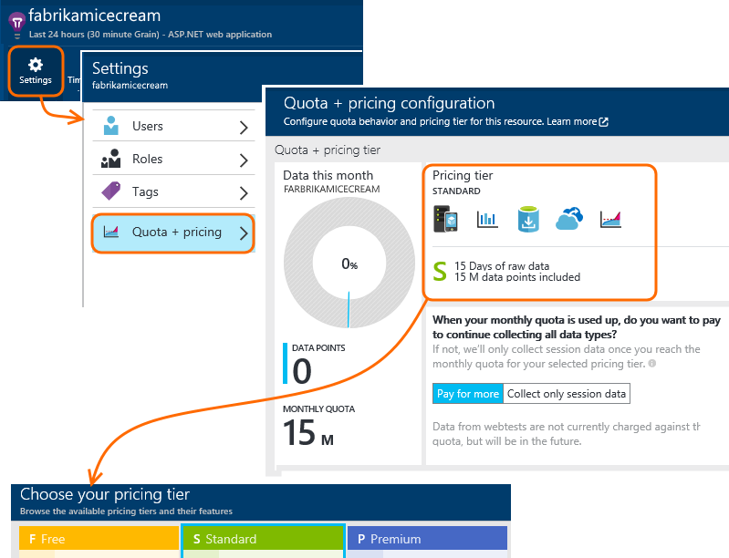
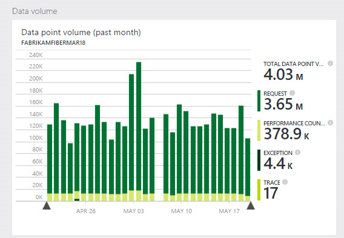

<properties 
	pageTitle="Manage pricing and quota for Application Insights" 
	description="Choose the price plan you need" 
	services="application-insights" 
    documentationCenter=""
	authors="alancameronwills" 
	manager="douge"/>

<tags 
	ms.service="application-insights" 
	ms.workload="tbd" 
	ms.tgt_pltfrm="ibiza" 
	ms.devlang="na" 
	ms.topic="article" 
	ms.date="06/09/2015" 
	ms.author="awills"/>

# Manage pricing and quota for Application Insights

*Application Insights is in preview.*

[Pricing][pricing] for [Visual Studio Application Insights][start] is based on data volume per application. There's a substantial Free tier in which you get most of the features with some limitations.

Each Application Insights resource is charged as a separate service, and contributes to the bill for your subscription to Azure.

[See the pricing scheme][pricing].

## Review quota and price plan for your Application Insights resource

You can open the Quota + Pricing blade from your application resource's Settings.

## How does the quota work?

* In each calendar month, your application can send up to a specified quantity of telemetry to Application Insights. See the [pricing scheme][pricing] for the  actual numbers. 
* The quota depends on the pricing tier that you have chosen.
* The quota is counted from midnight UTC on the first day of each month.
* The Data points chart shows how much of your quota has been used up this month.
* The quota is measured in *data points.* A single data point is a call to one of the Track methods, whether called explicitly in your code, or by one of the standard telemetry modules. Each row you see in diagnostic search is a data point. Each measurement of a metric such as a performance counter is a data point. 
* *Session data* is not counted in the quota. This includes counts of users, sessions, environment and device data.

## Overage

If your application sends more than the monthly quota, you can:

* Pay for additional data. See the [pricing scheme][pricing] for details. You can choose this option in advance. This option isn't available in the Free pricing tier.
* Upgrade your pricing tier.
* Do nothing. Session data will continue to be recorded, but other data will not appear in diagnostic search or in metrics explorer.

## Free Premium trial

When you first create a new Application Insights resource, it starts in the Free tier.

At any time, you can switch to the 30 day free Premium trial. This gives you the benefits of the Premium tier. After 30 days, it will automatically revert to whatever tier you were in before - unless you explicitly choose another tier. You select the tier you'd like at any time during the trial period, but you'll still get the free trial until the end of the 30-day period.

## How was my quota used?

The chart at the bottom of the pricing blade shows your application's data point usage, grouped by data point type. 

Click the chart for more detail, or drag across it for the detail of a time range.

## Review the bill for your subscription to Azure

Application Insights charges are added to your Azure bill. You can see details of your Azure bill on the Billing section of the Azure portal or in the [Azure Billing Portal](https://account.windowsazure.com/Subscriptions). 

<!--Link references-->

[start]: app-insights-get-started.md
[pricing]: http://azure.microsoft.com/pricing/details/application-insights/

 