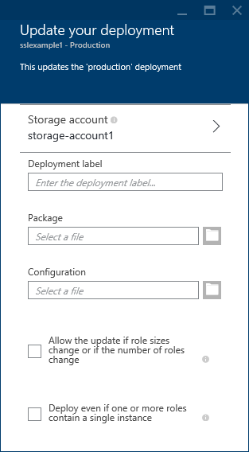

<properties 
	pageTitle="How to manage a cloud service - Azure" 
	description="Learn how to manage cloud services in the Azure Preview Portal." 
	services="cloud-services" 
	documentationCenter="" 
	authors="Thraka" 
	manager="timlt" 
	editor=""/>

<tags 
	ms.service="cloud-services" 
	ms.workload="tbd" 
	ms.tgt_pltfrm="na" 
	ms.devlang="na" 
	ms.topic="article" 
	ms.date="07/01/2015"
	ms.author="adegeo"/>

# How to Manage Cloud Services

> [AZURE.SELECTOR]
- [Azure Portal](cloud-services-how-to-manage.md)
- [Azure Preview Portal](cloud-services-how-to-manage-portal.md)

In the **Cloud Services** area of the Azure Preview Portal, you can update a service role or a deployment, promote a staged deployment to production, link resources to your cloud service so that you can see the resource dependencies and scale the resources together, and delete a cloud service or a deployment.

## How to: Update a cloud service role or deployment

If you need to update the application code for your cloud service, use **Update** on the cloud service blade. You can update a single role or all roles. You'll need to upload a new service package and service configuration file.

1. In the [Azure Preview Portal][], select the cloud service you want to update. This opens the cloud service instance blade.

2. In the blade, click the **Update** button.

    

3. Update the deployment with a new service package file (.cspkg) and service configuration file (.cscfg).

    

4. **Optionally** update the deployment label and the storage account. 

5. If the update changes the number of roles or the size of any role, select the **Allow update if role sizes or number of roles changes** check box to enable the update to proceed. 

	>[AZURE.WARNING] Be aware that if you change the size of a role (that is, the size of a virtual machine that hosts a role instance) or the number of roles, each role instance (virtual machine) must be re-imaged, and any local data will be lost.

6. If any service roles have only one role instance, select the **Update even if one or more role contain a single instance check box** to enable the upgrade to proceed. 

	Azure can only guarantee 99.95 percent service availability during a cloud service update if each role has at least two role instances (virtual machines). That enables one virtual machine to process client requests while the other is being updated.

8. Click **OK** to begin updating the service.

## How to: Swap deployments to promote a staged deployment to production

Use **Swap** to promote a staging deployment of a cloud service to production. When you decide to deploy a new release of a cloud service, you can stage and test your new release in your cloud service staging environment while your customers are using the current release in production. When you're ready to promote the new release to production, you can use **Swap** to switch the URLs by which the two deployments are addressed. 

You can swap deployments from the **Cloud Services** page or the dashboard.

1. In the [Azure Preview Portal][], select the cloud service you want to update. This opens the cloud service instance blade.

2. In the blade, click the **Swap** button.

    

3. The following confirmation prompt opens.

	

4. After you verify the deployment information, click **OK** to swap the deployments.

	The deployment swap happens quickly because the only thing that changes is the virtual IP addresses (VIPs) for the deployments.

	To save compute costs, you can delete the deployment in the staging environment when you're sure the new production deployment is performing as expected.

## How to: Link a resource to a cloud service

The Azure Preview Portal does not link resources together like the current Azure Portal does. Instead, you must deploy additional resources to the same resource group being used by the Cloud Service.

## How to: Delete deployments and a cloud service

Before you can delete a cloud service, you must delete each existing deployment.

To save compute costs, you can delete your staging deployment after you verify that your production deployment is working as expected. You are billed compute costs for role instances even if a cloud service is not running.

Use the following procedure to delete a deployment or your cloud service. 

1. In the [Azure Preview Portal][], select the cloud service you want to delete. This opens the cloud service instance blade.

2. In the blade, click the **Delete** button.

    

3. You can delete the entire cloud service by checking **Cloud service and its deployments** or choose either the **Production deployment** or the **Staging deployment**.

     

4. Click the **Delete** button at the bottom.

5. To delete the cloud service, click **Delete cloud service**. Then, at the confirmation prompt, click **Yes**.

> [AZURE.NOTE]
> If verbose monitoring is configured for your cloud service, Azure does not delete the monitoring data from your storage account when you delete the cloud service. You will need to delete the data manually. For information about where to find the metrics tables, see [this](cloud-services-how-to-monitor.md) article.

[Azure Preview Portal]: https://portal.azure.com