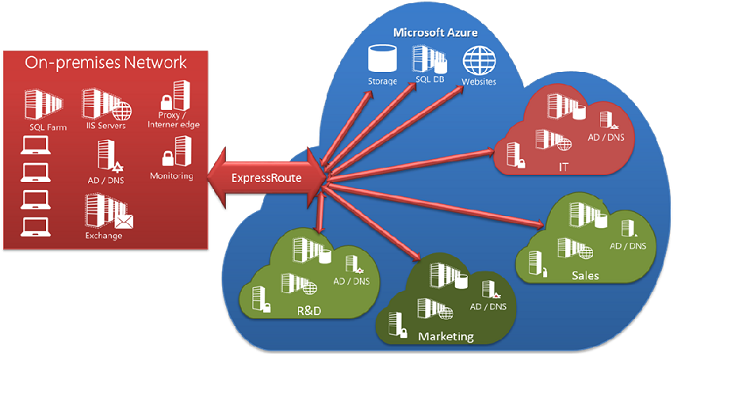
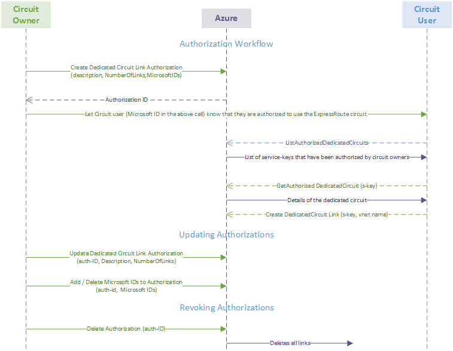

<properties 
   pageTitle="Sharing an ExpressRoute Circuit Across Multiple Subscriptions | Microsoft Azure"
   description="This article walks you through sharing your ExpressRoute circuit across multiple Azure subscriptions."
   services="expressroute"
   documentationCenter="na"
   authors="cherylmc"
   manager="jdial"
   editor="tysonn" />
<tags 
   ms.service="expressroute"
   ms.devlang="na"
   ms.topic="article"
   ms.tgt_pltfrm="na"
   ms.workload="infrastructure-services"
   ms.date="06/25/2015"
   ms.author="cherylmc" />

# Sharing an ExpressRoute circuit across multiple subscriptions

A single ExpressRoute circuit can be shared across multiple subscriptions. **Figure 1** shows a simple schematic of how sharing ExpressRoute circuits across multiple subscriptions works.

Each of the smaller clouds within the large cloud is used to represent subscriptions belonging to different departments within an organization. Each of the departments within the organization can use their own subscription for deploying their services but can share a single ExpressRoute dedicated circuit to connect back to the corporate network. A single department (in this example: IT) can own the ExpressRoute dedicated circuit. Connectivity and bandwidth charges for the dedicated circuit will be applied to the dedicated circuit owner. Other subscriptions within the organization can use the ExpressRoute circuit.

**Figure 1**

## Administration

The *circuit owner* is the administrator/co-administrator of the subscription in which the ExpressRoute dedicated circuit is created. The circuit owner can authorize administrators/co-administrators of other subscriptions (referred to as *circuit user* in the Workflow diagram) to use the dedicated circuit they own. Circuit users authorized to use the organization's dedicated circuit can link VNet in their subscription to the dedicated circuit once they are authorized.

The circuit owner has the power to modify and revoke authorizations at any time. Revoking an authorization will result in all links being deleted from the subscription whose access was revoked.

## Workflow

1. The circuit owner authorizes the administrators of other subscriptions to use the specified circuit. In the example below, the administrator of the circuit (Contoso IT) enables the administrator of another subscription (Contoso Sales), by specifying their Microsoft (Live) ID, to link up to 2 VNETs to the circuit. The cmdlet doesn't send email to the specified Microsoft ID. The circuit owner need to explicitly notify the other subscription owner that the authorization is complete.

		PS C:\> New-AzureDedicatedCircuitLinkAuthorization -ServiceKey '6ed7e310-1a02-4261-915f-6ccfedc416f1' -Description 'SalesTeam' -Limit 2 -MicrosoftIds 'salesadmin@contoso.com'
		
		Description         : SalesTeam 
		Limit               : 2 
		LinkAuthorizationId : e2bc2645-6fd4-44a4-94f5-f2e43e6953ed 
		MicrosoftIds        : salesadmin@contoso.com 
		Used                : 0

1. Once notified by the circuit owner, the administrator of the authorized subscription can run the following cmdlet to retrieve the service key of the circuit. In this example, the administrator of Contoso Sales must first sign in using the specified Microsoft ID, salesadmin@contoso.com.

		PS C:\> Get-AzureAuthorizedDedicatedCircuit
		
		Bandwidth                        : 100
		CircuitName                      : ContosoIT
		Location                         : Washington DC
		MaximumAllowedLinks              : 2
		ServiceKey                       : 6ed7e310-1a02-4261-915f-6ccfedc416f1
		ServiceProviderName              : ###########
		ServiceProviderProvisioningState : Provisioned
		Status                           : Enabled
		UsedLinks                        : 0

1. The administrator of the authorized subscription runs the following cmdlet to complete the link operation.

		PS C:\> New-AzureDedicatedCircuitLink –servicekey 6ed7e310-1a02-4261-915f-6ccfedc416f1 –VnetName 'SalesVNET1' 
		
			State VnetName 
			----- -------- 
			Provisioned SalesVNET1

And that's it. Conto's Sales VNet on Azure is now linked to a circuit created/owned by ContosoIT.

## Managing authorization

The circuit owner can share a circuit with up to 10 Azure subscriptions. The circuit owner can view who has been authorized to the circuit. The owner can revoke the authorization at any time.  When the circuit owner revokes an authorization, identified by LinkAuthorizationId, all links permitted by that authorization will be deleted immediately. The linked VNETs will lose connectivity to the on-premises network through the ExpressRoute circuit.

	PS C:\> Get-AzureDedicatedCircuitLinkAuthorization -ServiceKey: 6ed7e310-1a02-4261-915f-6ccfedc416f1 
	
	Description         : EngineeringTeam 
	Limit               : 3 
	LinkAuthorizationId : cc958457-c8c1-4f16-af09-e7f099da64bf 
	MicrosoftIds        : engadmin@contoso.com 
	Used                : 1 
	
	Description         : MarketingTeam 
	Limit               : 1 
	LinkAuthorizationId : d972726f-c7b9-4658-8598-ad3208ac9348 
	MicrosoftIds        : marketingadmin@contoso.com 
	Used                : 0 
	
	Description         : SalesTeam 
	Limit               : 2 
	LinkAuthorizationId : e2bc2645-6fd4-44a4-94f5-f2e43e6953ed 
	MicrosoftIds        : salesadmin@contoso.com 
	Used                : 2 
	
	PS C:\> Remove-AzureDedicatedCircuitLinkAuthorization -ServiceKey '6ed7e310-1a02-4261-915f-6ccfedc416f1' -AuthorizationId 'e2bc2645-6fd4-44a4-94f5-f2e43e6953ed'

The diagram below shows the Authorization Workflow:

## Next Steps

For more information about ExpressRoute, see the [ExpressRoute Overview](expressroute-introduction.md).

