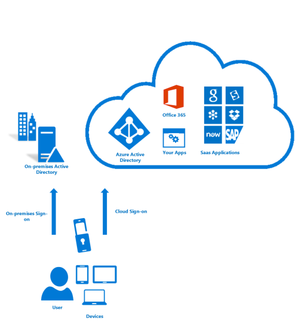

<properties 
	pageTitle="Azure Multi-Factor Authentication - How it works" 
	description="Azure Multi-Factor Authentication helps safeguard access to data and applications while meeting user demand for a simple sign-in process. It provides additional security by requiring a second form of authentication and delivers strong authentication via a range of easy verification options." 
	services="multi-factor-authentication" 
	documentationCenter="" 
	authors="billmath" 
	manager="terrylan" 
	editor="bryanla"/>

<tags 
	ms.service="multi-factor-authentication" 
	ms.workload="identity" 
	ms.tgt_pltfrm="na" 
	ms.devlang="na" 
	ms.topic="article" 
	ms.date="06/02/2015" 
	ms.author="billmath"/>

#How Azure Multi-Factor Authentication works

The security of multi-factor authentication lies in its layered approach. Compromising multiple authentication factors presents a significant challenge for attackers. Even if an attacker manages to learn the user's password, it is useless without also having possession of the trusted device. Should the user lose the device, the person who finds it won't be able to use it unless he or she also knows the user's password.

Azure Multi-Factor Authentication helps safeguard access to data and applications while meeting user demand for a simple sign-in process.  It provides additional security by requiring a second form of authentication and delivers strong authentication via a range of easy verification options:

- phone call 
- text message
- mobile app notification—allowing users to choose the method they prefer
- mobile app verification code
- 3rd party OATH tokens

For additional information oh how it works see the following video.

[AZURE.VIDEO multi-factor-authentication-deep-dive-securing-access-on-premises]

##Methods available for multi-factor authentication
When a user signs in, an additional verification is sent to the user.  The following are a list of methods that can be used for this second verification. 

Verification Method  | Description 
------------- | ------------- |
Phone Call | A call is placed to a user’s smart phone asking them to verify that they are signing in by pressing the # sign.  This will complete the verification process.  This option is configurable and can be changed to a code that you specify.
Text Message | A text message will be sent to a user’s smart phone with a 6 digit code.  Enter this code in to complete the verification process.
Mobile App Notification | A verification request will be sent to a user’s smart phone asking them complete the verification by selecting Verify from the mobile app. This will occur if you selected app notification as your primary verification method.  If they receive this when they are not signing in, they can choose to report it as fraud.
Verification code with Mobile App | A verification code will be sent to the mobile app that is running on a user’s smart phone.  This will occur if you selected a verification code as your primary verification method.

##Available versions of Azure Multi-Factor Authentication
Azure Multi-Factor Authentication is available in three different versions.  The table below describes each of these in more detail.

Version  | Description 
------------- | ------------- |
Multi-Factor Authentication for Office 365 | This version works exclusively with Office 365 applications and is managed from the Office 365 portal. So administrators can now help secure their Office 365 resources by using multi-factor authentication.  This version comes with an Office 365 subscription.
Multi-Factor Authentication for Azure Administrators | The same subset of Multi-Factor Authentication capabilities for Office 365 will be available at no cost to all Azure administrators. Every administrative account of a Azure subscription can now get additional protection by enabling this core multi-factor authentication functionality. So an administrator that wants to access Azure portal to create a VM, a web site, manage storage, mobile services or any other Azure Service can add multi-factor authentication to his administrator account.
Azure Multi-Factor Authentication | Azure Multi-Factor Authentication offers the richest set of capabilities.  It provides additional configuration options via the Azure Management portal, advanced reporting, and support for a range of on-premises and cloud applications.  Azure Multi-Factor Authentication comes as part of Azure Active Directory Premium.

##Feature comparison of versions
The following table below provides a list of the features that are available in the various versions of Azure Multi-Factor Authentication.

Feature  | Multi-Factor Authentication for Office 365 (included in Office 365 SKUs)|Multi-Factor Authentication for Azure Administrators (included with Azure subscription) | Azure Multi-Factor Authentication (included in Azure AD Premium and Enterprise Mobility Suite) 
------------- | :-------------: |:-------------: |:-------------: |
Administrators can protect accounts with MFA| * | * (Available only for Azure Administrator accounts)|*
Mobile app as a second factor|* | * | *
Phone call as a second factor|* | * | *
SMS as a second factor|* | * | *
App passwords for clients that don't support MFA|* | * | *
Admin control over authentication methods| | | *
PIN mode| | | *
Fraud alert| | | *
MFA Reports| | | *
One-Time Bypass| | | *
Custom greetings for phone calls| | | *
Customization of caller ID for phone calls| | | *
Event Confirmation| | | *
Trusted IPs| | | *
Suspend MFA for remembered devices (Public Preview)| | | *
MFA SDK| | | *
MFA for on-premises applications using MFA server| | | *

##How to get Azure Multi-Factor Authentication

Azure Multi-Factor Authentication comes as part of Azure Active Directory Premium and the Enterprise Mobility Suite.  If you already have these then you have Azure Multi-Factor Authentication.

If you are an Office 365 users or an Azure subscriber and want to take advantage of the additional features provide by Azure Multi-Factor Authentication then continue reading.

If you do not have any of the above, then to begin using Azure Multi-Factor Authentication, you first need an Azure subscription or an [Azure trial subscription](http://azure.microsoft.com/pricing/free-trial/). 

When using Azure Multi-Factor Authentication there are two billing options available:

- **Per User**. Generally for enterprises that want to enable multi-factor authentication for a fixed number of employees who regularly need authentication.
- **Per Authentication**. Generally for enterprises that want to enable multi-factor authentication for a large group of external users who infrequently need authentication.

For pricing details see [Azure MFA Pricing.](http://azure.microsoft.com/pricing/details/multi-factor-authentication/)

Choose the model that works best for your organization.  Then to get started see [Getting Started](multi-factor-authentication-get-started.md)

 