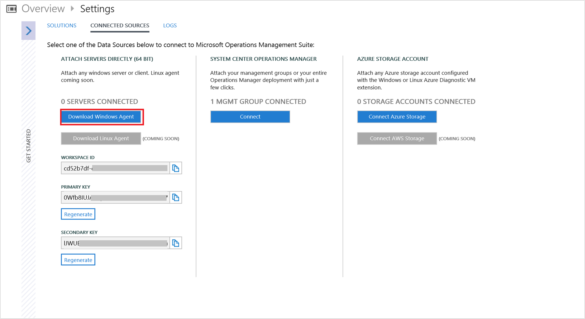
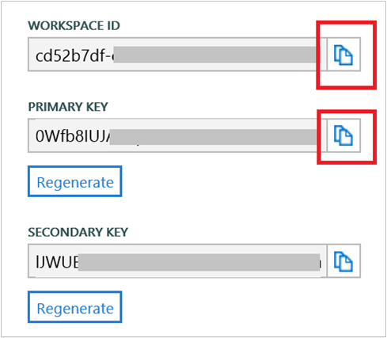

<properties
	pageTitle="Connect computers directly to Operational Insights "
	description="You can connect computers directly to Operational Insights by installing the Operational Insights agent to each computer you want to on board."
	services="operational-insights"
	documentationCenter=""
	authors="bandersmsft"
	manager="jwhit"
	editor=""/>

<tags
	ms.service="operational-insights"
	ms.workload="na"
	ms.tgt_pltfrm="na"
	ms.devlang="na"
	ms.topic="article"
	ms.date="07/02/2015" 
	ms.author="banders"/>
# Connect computers directly to Operational Insights

[AZURE.INCLUDE [operational-insights-note-moms](../../includes/operational-insights-note-moms.md)]

You can connect computers directly to Operational Insights by installing the Operational Insights agent on each computer you want to on board.

> [AZURE.TIP] For virtual machines running in Azure, install the agent by following the steps in [Analyze data from servers in Microsoft Azure](operational-insights-analyze-data-azure.md)

## Download and install the agent
Use the following procedures to download and install the Operational Insights agent.

### To download the agent setup file
1. In the Operational Insights portal, on the **Overview** page, click the **Settings** tile.  Click the **Connected Sources** tab at the top.

2. Under **Attach Servers Directly (64 bit)**, click the Download Agent button to download the setup file.
3. On the right of the **Workspace ID**, click the copy icon and paste the ID into Notepad.
4. On the right of the **Primary Key**, click the copy icon and paste the ID into Notepad.


### To install agent using setup
1. Run Setup to install the agent on a computer that you want to manage.
2. Select **Connect the agent to Microsoft Azure Operational Insights** and then click **Next**.
3. When prompted, enter the **Workspace ID** and **Primary Key** that you copied into Notepad in the previous procedure.

4. Click **Next**.  The agent verifies that it can connect to Operational Insights.
5. When complete, the **Microsoft Management Agent** appears in **Control Panel**.

### To install agent using the command line
- Modify and then use the following example to install the agent using the command line.
```MMASetup-AMD64.exe /C:"setup.exe /qn ADD_OPINSIGHTS_WORKSPACE=1 OPINSIGHTS_WORKSPACE_ID=<your workspace id> OPINSIGHTS_WORKSPACE_KEY=<your workspace key> AcceptEndUserLicenseAgreement=1"```

## Configure the Microsoft Monitoring Agent (optional)
Use the following information to enable an agent to communicate directly with the Microsoft Azure Operational Insights service. After you've configured the agent, it will register with the agent service and will get necessary configuration information and management packs that contain solution information.

After data is collected from computers monitored by the agent, the number of computers monitored will appear in the Operational Insights portal in the **Connected Sources** tab in **Settings** under **Attach Servers Directly (64 bit)**. For any computer that sends data, you can view its data and assessment information in the Operational Insights portal.

You can also disable the agent, if needed or you enable it using the command line or script.

### To configure the agent
1. After you've installed the **Microsoft Monitoring Agent**, open **Control Panel**.
2. Open Microsoft Monitoring Agent and then click the Azure Operational Insights tab.
3. Select **Connect to Azure Operational Insights**.
4. In the **Workspace ID** box, paste the Workspace ID from the Operational Insights portal.
5. In the **Account Key** box, paste the **Primary Key** from the Operational Insights portal and then click **OK**.

### To disable an agent
1. After installing the agent, open **Control Panel**.
2. Open Microsoft Monitoring Agent and then click the **Azure Operational Insights** tab.
3. Clear **Connect to Azure Operational Insights**.

### To Enable the agent using the command line or script
- You can use either Windows PowerShell or a VB script with the following example.

```powershell
$healthServiceSettings = New-Object -ComObject 'AgentConfigManager.MgmtSvcCfg'
$healthServiceSettings.EnableOnlineMonitoring('workspacename', 'workspacekey')
$healthServiceSettings.ReloadConfiguration()
```

## Configure proxy and firewall settings (optional)
If you have proxy servers or firewalls in your environment that restrict access to the Internet, you might need to follow the following procedures to enable Operations Manager or agents to communicate to the Operational Insights service.

- [Configure proxy and firewall settings (Optional)](operational-insights-proxy-firewall.md)
