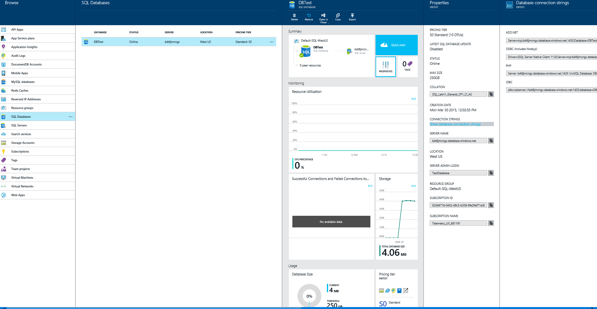

<properties
	pageTitle="Connect to and query your SQL Database with C#"
	description="Code sample for a C# client using ADO.NET to connect to and interact with the AdventureWorks database on the Azure SQL Database cloud service."
	services="sql-database"
	documentationCenter=""
	authors="ckarst"
	manager="jeffreyg"
	editor=""/>

<tags
	ms.service="sql-database"
	ms.workload="data-management"
	ms.tgt_pltfrm="na"
	ms.devlang="dotnet"
	ms.topic="get-started-article" 
	ms.date="04/14/2015"
	ms.author="cakarst"/>

# Connect to and query your SQL Database with C&#x23;

This topic provides a C# code sample that shows you how to connect to an existing AdventureWorks SQL Database by using ADO.NET. The sample compiles to a console application that queries the database and displays the result set.

## Prerequisites

- An existing AdventureWorks database on Azure SQL Database. [Create one in minutes](sql-database-get-started.md).
- [Visual Studio with the .NET Framework](https://www.visualstudio.com/en-us/visual-studio-homepage-vs.aspx)

## Step 1: Console application

1. Create a C# console application using Visual Studio.

## Step 2: SQL code sample

1. Copy and paste the code sample below into your console application.

> [AZURE.WARNING] The code sample is designed to be as short as possible to make it easy to understand. The sample is not meant to be used in production.

This code is not meant for production. If you would like to implement production ready code, the following are considered industry best practices:

- Exception handling.
- Retry logic for transient errors.
- Safe storage of passwords in a configuration file.

### Source code for C# sample

Paste this source code into your **Program.cs** file.

	using System;  // C#
	using System.Collections.Generic;
	using System.Linq;
	using System.Text;
	using System.Threading.Tasks;
	using System.Data.SqlClient;

	namespace ConnectandQuery_Example
	{
		class Program
		{
			static void Main()
			{
				string SQLConnectionString = "[Your_Connection_String]";
				// Create a SqlConnection from the provided connection string.
				using (SqlConnection connection = new SqlConnection(SQLConnectionString))
				{
					// Begin to formulate the command.
					SqlCommand command = new SqlCommand();
					command.Connection = connection;

					// Specify the query to be executed.
					command.CommandType = System.Data.CommandType.Text;
						command.CommandText =
						@"SELECT TOP 10
						CustomerID, NameStyle, Title, FirstName, LastName
						FROM SalesLT.Customer";

					// Open connection to database.
					connection.Open();

					// Read data from the query.
					SqlDataReader reader = command.ExecuteReader();
					while (reader.Read())
					{
						// Formatting will depend on the contents of the query.
						Console.WriteLine("Value: {0}, {1}, {2}, {3}, {4}",
							reader[0], reader[1], reader[2], reader[3], reader[4]);
					}
				}
				Console.WriteLine("Press any key to continue...");
				Console.ReadKey();
			}
		}
	}

## Step 3: Find the connection string for your database

1. Open the [Azure preview portal](http://portal.azure.com/).
2. Click **Browse** > **SQL Databases** > **“Adventure Works” Database**> **Properties** > **Show Database Connection Strings**.

On the database connection strings blade, you can find the appropriate connection strings for ADO.NET, ODBC, PHP, and JDBC.

## Step 4: Substitute real connection information

- In the source code you pasted, replace the *[Your_Connection_String]* placeholder with the connection string, and be sure to replace *your_password_here* in that string with your actual password.

## Step 5: Run the application

1. To build and run your application, click **DEBUG** > **Start Debugging**
2. The program prints the query results to the console window.
 