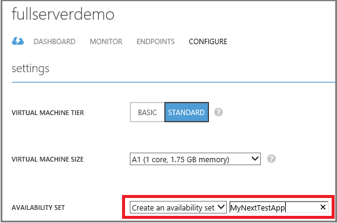

<properties 
	pageTitle="How to Configure An Availability Set for Virtual Machines" 
	description="Gives the steps to configure an availability set for a new or existing VM in Azure using the Azure Management Portal and Azure PowerShell commands" 
	services="virtual-machines" 
	documentationCenter="" 
	authors="KBDAzure" 
	manager="timlt" 
	editor=""/>

<tags 
	ms.service="virtual-machines" 
	ms.workload="infrastructure-services" 
	ms.tgt_pltfrm="vm-multiple" 
	ms.devlang="na" 
	ms.topic="article" 
	ms.date="03/31/2015" 
	ms.author="kathydav"/>

#How to Configure An Availability Set for Virtual Machines#

An availability set helps keep your virtual machines available during downtime, such as during maintenance. Placing two or more similarly configured virtual machines in an availability set creates the redundancy needed to maintain availability of the applications or services that your virtual machine runs. For details about how this works, see [Manage the Availability of Virtual Machines] []. 

It's a best practice to use both availability sets and load-balancing endpoints to help ensure that your application is always available and running efficiently. For details about load-balanced endpoints, see [Load Balancing for Azure Infrastructure Services] [].

You can put virtual machines into an availability set using one of two options:

- [Option 1: Create a virtual machine and an availability set at the same time] []. Then, add new virtual machines to the set when you create those virtual machines.
- [Option 2: Add an existing virtual machine to an availability set] [].

>[AZURE.NOTE] Virtual machines that you want to put in the same availability set must belong to the same cloud service.   

## Option 1: Create a virtual machine and an availability set at the same time##

You can use either the Management Portal or Azure PowerShell commands to do this. 

To use the Management Portal:

1. If you haven't already done so, sign in to the [Azure Management Portal](http://manage.windowsazure.com).

2. On the command bar, click **New**.

3. Click **Virtual Machine**, and then click **From Gallery**.

4. Use the first two screens to pick an image, a user name and password, and so on. For more details, see [Create a Virtual Machine Running Windows][].
 
5. The third screen lets you configure resources for networking, storage, and availability. Do the following:
	 
	1. Pick the appropriate choice for cloud service. Leave it set to **Create a new cloud service** (unless you are adding this new virtual machine to an existing VM cloud service). Then, under **Cloud Service DNS Name**, type a name. The DNS name becomes part of the URI that's used to contact the virtual machine. The cloud service acts as a communications and isolation group. All virtual machines in the same cloud service can communicate with each other, can be set up for load balancing, and can be placed in the same availability set. 

	2. Under **Region/Affinity Group/Virtual Network**, specify a virtual network if you plan to use one. **Important**: If you want a virtual machine to use a virtual network, you must join the VM to the virtual network when you create the virtual machine. You can't join the virtual machine to a virtual network after you create the VM. For more information, see [Virtual Network Overview][]. 
	
	3. Create the availability set. Under **Availability Set**, leave it set to **Create an availability set**. Then, type a name for the set. 

	4. Create the default endpoints and add more endpoints if needed. You also can add endpoints later. 

	 

6. On the fourth screen, choose the extensions you want to install. Extensions provide features that make it easier to manage the virtual machine, such as running antimalware or resetting passwords. For details, see [Azure VM Agent and VM Extensions](http://go.microsoft.com/fwlink/p/?LinkId=XXX).

7.	Click the arrow to create the virtual machine and the availability set.

	From the dashboard of the new virtual machine, you can click **Configure** to see that the virtual machine belongs to the new availability set.

To use Azure PowerShell commands to create an Azure VM and add it to a new or existing availability set, see the following:

- [Use Azure PowerShell to create and preconfigure Windows-based Virtual Machines](virtual-machines-ps-create-preconfigure-windows-vms.md)
- [Use Azure PowerShell to create and preconfigure Linux-based Virtual Machines](virtual-machines-ps-create-preconfigure-linux-vms.md)

## Option 2: Add an existing virtual machine to an availability set##

In the Management Portal, you can add existing virtual machines to an existing availability set, or create a new one for them. (Keep in mind that the virtual machines in the same availability set must belong to the same cloud service.) The steps are almost the same. With Azure PowerShell, you can add the virtual machine to an existing availability set. 

1. If you have not already done so, sign in to the [Azure Management Portal](http://manage.windowsazure.com).

2. On the navigation bar, click **Virtual Machines**.

3. From the list of virtual machines, click the name of the virtual machines you want to add to the set.

4. From the tabs below the virtual machine name, click **Configure**. 

5. In the Settings section, find **Availability Set**. Do one of the following:

	A. Pick **Create an availability set**, and then type a name for the set.

	B. Pick **Select an availability set**, and then pick a set from the list.

	 

6. Click **Save**.

To use Azure PowerShell commands, open an administrator-level Azure PowerShell session and run the following command. For the placeholders (such as &lt;VmCloudServiceName&gt;), replace everything within the quotes, including the < and > characters, with the correct names.

	Get-AzureVM -ServiceName "<VmCloudServiceName>" -Name "<VmName>" | Set-AzureAvailabilitySet -AvailabilitySetName "<AvSetName>" | Update-AzureVM

>[AZURE.NOTE] The virtual machine might be restarted to finish adding it to the availability set.

##Additional resources
[About Azure VM configuration settings]

<!-- LINKS -->
[Option 1: Create a virtual machine and an availability set at the same time]: #createset
[Option 2: Add an existing virtual machine to an availability set]: #addmachine
[Load Balancing for Azure Infrastructure Services]: virtual-machines-load-balance.md
[Manage the Availability of Virtual Machines]: virtual-machines-manage-availability.md
[Create a Virtual Machine Running Windows]: virtual-machines-windows-tutorial.md
[Virtual Network Overview]: http://msdn.microsoft.com/library/azure/jj156007.aspx
[About Azure VM configuration settings]: http://msdn.microsoft.com/library/azure/dn763935.aspx

 